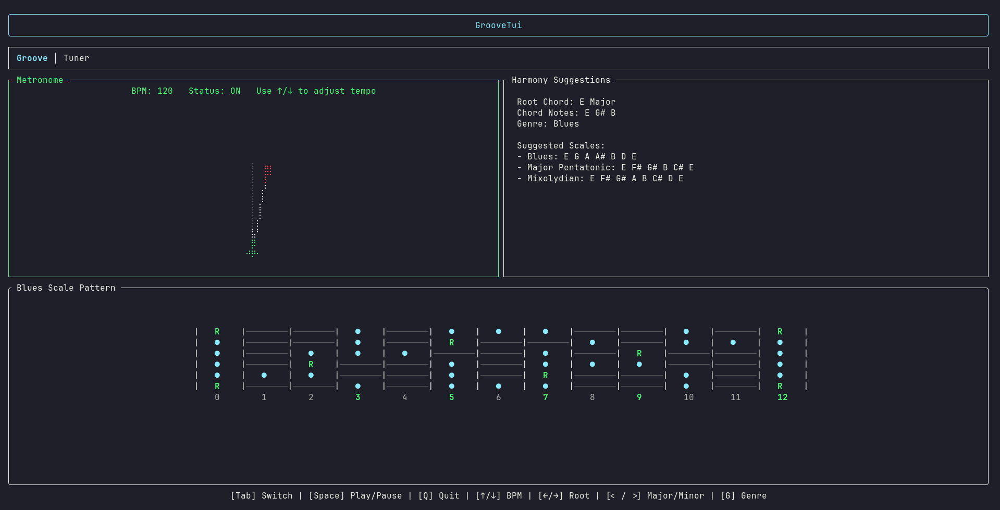
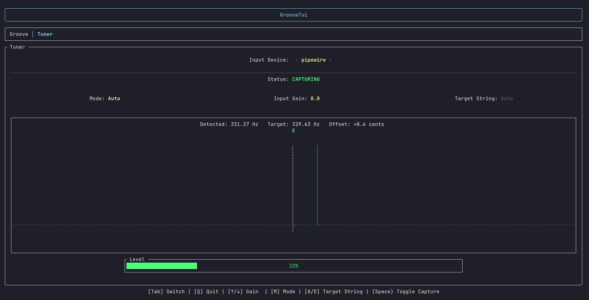

# GrooveTui

GrooveTui is a minimalist guitar practice companion for the terminal. Built in Rust, it combines a metronome, harmony suggestions, a fretboard view, and a real-time tuner inside a fast TUI.

## Controls

Global
- `Tab`: switch tabs
- `Q`: quit

Groove tab
- `Space`: play/pause metronome
- `Arrow Up`: increase BPM
- `Arrow Down`: decrease BPM
- `Arrow Left`: previous root note
- `Arrow Right`: next root note
- `,`: minor chord quality
- `.`: major chord quality
- `G`: previous genre
- `H`: next genre

Tuner tab
- `Space`: toggle capture
- `Arrow Left`: previous input device
- `Arrow Right`: next input device
- `Arrow Up`: increase input gain
- `Arrow Down`: decrease input gain
- `M`: toggle auto/manual mode
- `A`: previous target string (manual mode)
- `D`: next target string (manual mode)

## Usage

Install it with:

```bash
cargo install groove-tui
```

```bash
groove-tui
```

```bash
cargo run --release
```

Use `Tab` to switch between Groove and Tuner. In the Tuner tab, select an input device and press `Space` to start capture.

## Screenshots

### Groove tab



### Tuner tab



## Tech Stack

- Rust
- ratatui
- crossterm
- rodio
- cpal
- pitch-detection
- rust-music-theory
